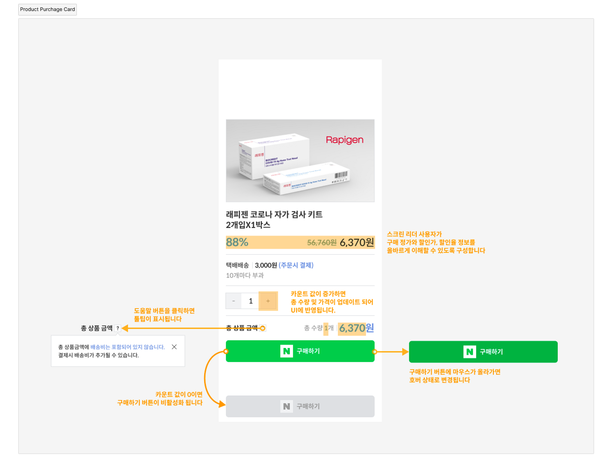
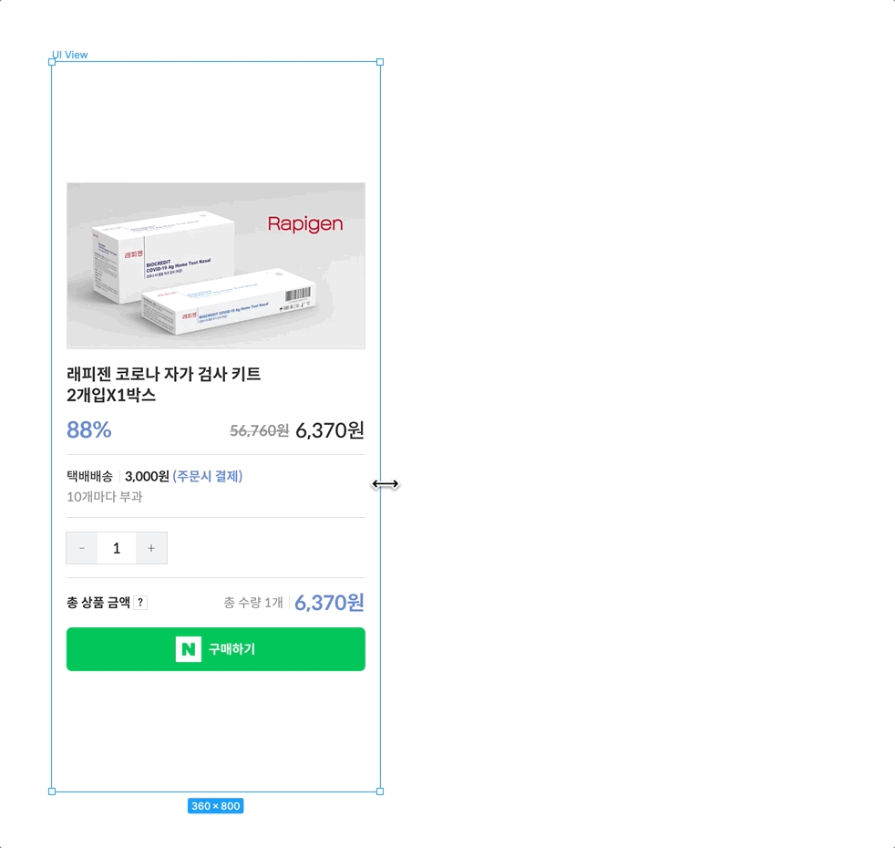

학습한 React 개발 능력을 스스로 진단해보세요. 😃

## 요구 사항

- **모든 것을 완성해야 한다는 것이 아닙니다. 만들 수 있는 부분까지 수행하면 됩니다. 
기능 구현이 어려운 분들은 최소한 컴포넌트 UI가 화면에 표시되도록 도전해 봅시다.**
- 컴포넌트 타입은 Function 또는 Class 중 선호하는 방법을 사용합니다.
- 컴포넌트 props, state를 구분해 효율적으로 구현합니다.
- 컴포넌트 상태가 변경되면 UI가 업데이트 되어야 합니다.
- WAI-ARIA 기술 사양을 검토해 웹 접근성을 준수합니다.

***

## 제품 구매 카드 UI

Product Purchage Card 디자인 시안을 복제(duplicate)한 후, UI를 React를 사용해 구현합니다.



## 유연한 레이아웃

디자인 시안에 반영된 것처럼 뷰포트의 너비에 따라 레이아웃이 유연하게 반응하도록 구현합니다.



데스크탑 화면에서는 최대 너비를 가지도록 설정하고, 가로 축 방향 가운데 배치 되도록 설정합니다.

```css
.viewport {
	**width: clamp(320px, 100vw, 800px);**
}
```

[clamp() - CSS: Cascading Style Sheets | MDN](https://developer.mozilla.org/en-US/docs/Web/CSS/clamp)

아래 데모 코드를 참고하세요.

[https://codepen.io/yamoozida/pen/MWEpPzq?editors=1100](https://codepen.io/yamoozida/pen/MWEpPzq?editors=1100)

## 접근성 준수 참고

스크린 리더 사용자를 위한 마크업은 아래 슬비쌤 강의를 참고하세요.

[스크린리더 사용자를 위한 착한마크업 1편(상품가격 및 할인율)](https://youtu.be/lmYSIiZFxPI?t=36)